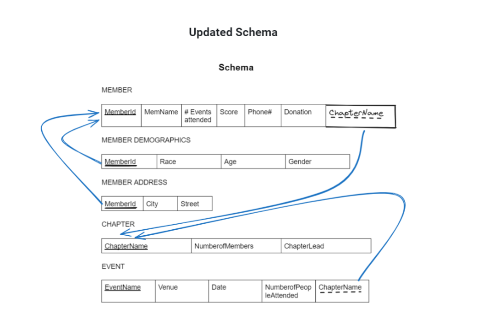

# Domain Names

# Member
| Attribute       | Domain Name  | Description                                 | Domain                        |
|-----------------|--------------|---------------------------------------------|-------------------------------|
| MemberID        | Member IDs   | Set of all possible member IDs              | character: size 10            |
| Score           | Scores       | Set of all possible scores                  | integer: 3 digits             |
| Phone #         | Phone Numbers| Set of all possible member phone numbers    | integer: 10 digits            |
| MemberName      | Names        | Set of all possible member names            | character: size 25            |
| Address         | Addresses    | Set of all possible member addresses        | Character: size 30            |
| Demographic     | Demographics | Set of all possible member demographics     | character: size 25            |
| Donation        | Donations    | Set of all possible member donations        | character: size 25            |
| NumberOfEventsAttended | Events| Set of all possible member attended events | integer: 3 digits             |

# Chapter
| Attribute       | Domain Name  | Description                               | Domain                        |
|-----------------|--------------|-------------------------------------------|-------------------------------|
| ChapterName      | Names        | Set of all possible member names          | character: size 25            |
| NumberOfMembers | Numbers      | Set of all possible member numbers        | integer: 4 digits             |
| ChapterLead     | Names        | Set of all possible chapter lead names    | character: size 25            |

# Event
| Attribute   | Domain Name | Description                           | Domain                      |
|-------------|-------------|---------------------------------------|-----------------------------|
| EventName   | Names       | Set of all possible member names      | character: size 25          |
| Venue       | Locations   | Set of all possible locations         | character: size 30          |
| EventDate   | Dates       | Set of all possible dates             | date: format mm/dd/yy       |
| Attendance  | Numbers     | Set of all possible member attendance | integer: 3 digits           |

# Schema

# Reflections & Changes
- Our previous version was missing a domain for each entity type. 
- We created a table for each entity type where we detailed the attribute name, description, and domain (type and size limit) for each attribute of the entity.
- We also identified all multivalued attributes among the attributes of each entity type and restructured our E-R Diagram and Schema Design accordingly. 
- All spelling errors were also corrected.

