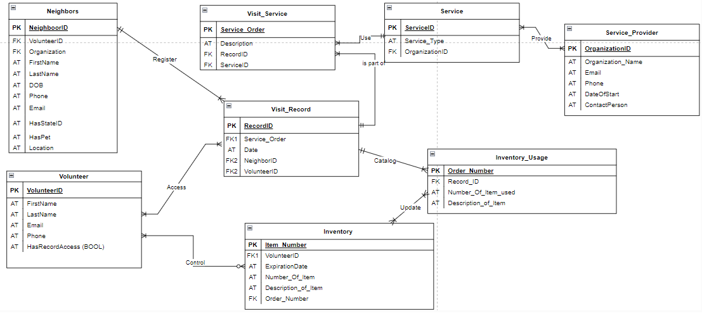

# project-milestones
For working with each project milestone 

# Milestone 1: Creating A Data Model
**Learning Objective:** Setup your teams, decide roles, and practice Git while you're at it

## List and description of data sources 

UP data: Since UP is a local, small non-profit, the only data they want to use is directly related to their operational process. Thus, the list of data is:
	Neighbors: each individual who needs assistance from the organization. As part of its policies, UP only registers them on their second visit. This registration includes name, 
	Partners: what is the partner and what service do they provide.
	Inventory: the organization is almost completely privately funded on the basis of donations, and the different forms of products they receive are registered on paper.

## Business Rules (both data and non-data) 

A NEIGHBOR is registered by a VOLUNTEER on the VISIT RECORD only once on their second visit to UP, whereas the RECORD registers only one NEIGHBOR by at least one VOLUNTEER.

A VISIT SERVICE can be part of only one VISIT RECORD, and a VISIT RECORD has part on many VISIT SERVICE. 

A VISIT SERVICE uses only one SERVICE, whereas a SERVICE is used in at least one VISIT SERVICE.

A SERVICE PROVIDER provides at least one SERVICE, whereas a SERVICE can be provided by at least one SERVICE PROVIDER.

The INVENTORY is controled by at least one VOLUNTEER, whereas a VOLUNTEER controls optional many INVENTORY items.

The INVENTORY is updated by at least one INVENTORY USAGE form, whereas an INVENTORY USAGE log updates at least one INVENTORY item.

The VISIT RECORD catalogs at least one INVENTORY USAGE, whereas an INVENTORY USAGE is cataloged by only one VISIT RECORD.

An VOLUNTEER has access to many VISIT RECORD data, whereas the VISIT RECORD can be accessed by many VOLUNTEERS with access.

Using the VISIT SERVICE, a VOLUNTEER can start a process to assist the NEIGHBOR in receiving many VISIT SERVICE. 

A VISIT SERVICE is provided by one SERVICE PROVIDER , whereas a SERVICE PROVIDER can provide at least one SERVICE. The SERVICE is then tracked on the NEIGHBOR’s record and followed up as necessary by at least one UP ADMINISTRATOR. 

## Entity Names and Definitions

Neighbors: a houseless person who seeks UP for support. They can be classified as emergency housed (e.g. a person sleeps in someone’s house), underhoused (they may have a shelter, but it is not optimal. e.g. a shed or trailer without access to electricity or water, or similar precarious situations).
Attributes: NeighborID, FirstName, LastName, Date of Birth, phone, email HasStateId (bool), HasPet (bool), location.

Volunteer: a person who works at UP initiative and can or cannot have access to records.
Attributes: VolunteerID, FirstName, LastName, Email, Phone, HasRecordAccess (bool)

Visit Service: in order to catalog what activities UP is doing, the visit service registers what specific unique work was done to the Neighbor in consultation.
Attributes: ServiceOrder, description, RecordID (foreignKey)

Visit Record: history of services provided per day to different neighbors.
Attributes: RecordID, Service_Order (foreign key), NeighborID (foreign Key), VolunteerID (Foreign Key)

Service Providers: every organization that assist the neighbors, being UP itself or their partners.
Attributes: OrganizationID, Organization_Name, Email, Phone, DateofStart, ContactPerson.

Service: The type of services that one organization can provide
Attributes: ServiceID, Service_Type, OrganizationID (foreign key)

Inventory: the organization has an inventory of clothing, hygiene kits, and food, and there are some guidelines about how many items can a neighbor have. These guidelines are always changing on a case-by-case basis. UP also envisions this process being automatize and displayed on their website so donors can see what the organization needs the most.
Attributes: Item_Number, VolunteerID, ExpirationDate, NumerofItem, Description_of_Item

Inventory_Usage: accountability of the items from the inventory used on a service provided by UP to neighbors.
Attributes: Order_Number, RecordID (foreign key), NumberofItem, DescriptionOfItem 

## Relationships

### Neighbors to Visit Records
One-to-Many: A NEIGHBOR is registered in at least one VISIT_RECORD, and a VISIT_RECORD registers only one NEIGHBOR per entry.

### Visit Record to Visit Service
One-to-Many: A VISIT_SERVICE is part of at least one VISIT_RECORD, whereas a VISIT_RECORD is part of one VISIT_SERVICE.

### Visit Service to Service
One-to-Many: A VISIT_SERVICE uses only one SERVICE, whereas a SERVICE can be used by many VISIT_SERVICE.

### Service to Service_Provider
Many-to-Many: A SERVICE is provided by many SERVICE_PROVIDER, whereas a SERVICE_PROVIDER provides at least one SERVICE.

### Visit Record to Inventory Usage
One-to-Many: a VISIT_RECORD saves many INVENTORY_USAGE records, whereas an INVENTORY_USAGE can be saved by only one VISIT_RECORD.

### Inventory_Usage to Inventory
Many-to-Many: A INVENTORY_USAGE log updates many INVENTORY, whereas an INVENTORY is updated by many INVENTORY_USAGE.

### Visit_Record to Volunteer
Many-to-Many: A VOLUNTER with permission accesses many VISIT_RECORD, whereas a VISIT_RECORD is accessed by many VOLUNTEERS with permission.

### Volunteer to Inventory
One-to-Many: A VOLUNTEER is controls optional many INVENTORY, whereas an INVENTORY is controlled by many VOLUNTEERS. 

## **Entity Relationship Diagram (ERD)**: 

# Milestone 2: Project Schema Design
**Learning Objective:** 
Translating conceptual ER diagrams into relational schemas.
Representing real-world organizational data as a relational data model
Observe how conceptual design decisions translate into the logical design stage

## Reflection:

We discussed how the ERD model really helped us visualize the logic behind each relationship and entity. The visual aid was very useful to us. Using the ERD tools that were available to us, we were able to easily make changes, which was extremely important as we kept adjusting the logic behind our process.
We would have been more specific with our attributes to prevent confusion. We also would have spent more time planning what would be Primary and Foreign Keys!

## Changes from the ERD model: 
In order to reorganize our model, we created the entity called Visit Service, which serves to describe what was done during a neighbor visit to UP. Our information now is restructured in a way that the neighbor will be registered on the Visit Record through the Visit Service entity. Additionally, inventory usage is an entity to support information about which items of the inventory were used per visit record. Service Provider was added to ensure coherence with Service, which can be one of UP partners or UP itself. Since a service provider can have more than one service, we created an associative entity called "service" so the visit service has exactly which service was provided by which service provider. Visit record is the central piece of this diagram, and it contains the information regarding what happened in a certain day to a certain neighbor who sought UP assistance.

## Schema

# Milestone 3: Data-Driven Application - Getting Started
**Deliverable 1:**
List of application users, with a description of their application use goals.
Volunteers – administrator access. They can input and edit the data on the database.
Donors – people who donate to an organization. They do not have access to the database.
Neighbors - People who are being helped by the organization. They have restricted access to the
application, where they can view information, and add data that gets sent to the database.

**Deliverable 2:** 
List of information needs (at least 15-20 across the group), with priorities for
the client and C,R,U,D, annotations to indicate functionality needed.
	1) The Volunteer wants to know “How many neighbors are being assisted?” (high) R
	2) The Volunteer needs to input information about a service provided. (High) C
	3) The Volunteer needs to input information about a neighbor. (High) C
	4) The Volunteer needs to update information about a neighbor. (High) U
	5) The Volunteer needs to update the information on items in the inventory. (High) U
	6) The Volunteer wants to know “What kind of assistance are the neighbors getting?” (high)
R
	7) The Volunteer wants to know “What is the most recurrent assistance type?” (low) R
	8) The Volunteer needs to know “Who are UP's active partners?” (low) R
	9) Which volunteers have access to the Visit_Record? (low) R
	10) The donor needs to know “What are the most needed items for the inventory?” (high) R
	11) The Neighbor requires emergency contact details for immediate assistance. (High) R
	12) The Neighbor wishes to update their personal contact information. (High) U
	13) The Neighbor wants to request a specific type of assistance from available services.
	(High) C
	14) The Neighbor wants to provide feedback on the services received. (Medium) C
	15) The Volunteer needs to schedule a visit or service for a neighbor. (High) C

**Deliverable 3:** 
3-4 data flow diagrams, each with 2 information needs depicted.
Flow Diagram 1:

Flow Diagram 2:

Flow Diagram 3:

Flow Diagram 4:

**Deliverable 4:** 
Sketches for the user interfaces, with each data flow represented. A UI can
include multiple data flows, but a data flow might require multiple UI’s (e.g. one for input,
one for output).

UI Sketch 1:

UI Sketch 2:

# Milestone 4: Create Database Schema
**Deliverables:**

1. If not completed in Milestone 2, create a relational schema for your client database. Use lines to show Foreign Key relationships. Use text style notation (example below) and organize your relations so lines to not overlap.

	Visit_Record (RecordID, ServiceOrder, Date, NeighborID, VolunteerID)
	Visit_Service (ServiceOrder, Description, RecordID (FK), ServiceID (FK))
	Inventory (Item_Number, VolunteerID, ExpirationDate, Number_of_Item, Description_of_Item, Order_Number (FK))
	Inventory_Usage (Order_Number, RecordID (fk), Number_of_Item, Description_of_Item)
	Volunteer (VolunteerID, FirstName, LastName, Email, Phone, HasRecordAccess)
	Neighbor (NeighborID, VolunteerID (FK), Organization (FK), FirstName, LastName, DateOfBirth, Phone, Location, Email, HasStateID, HasPet)
	Service_Provider (OrganizationID, Organization_Name, ContactPerson, Email, Phone)
	Service (ServiceID, Service_Type Organization (FK))

2. Normalize your relations to at least 3NF. Write out new normalized schema, along with documentation of decisions. Your documentation should show proof of no partial or transitive dependencies. Save all in a file called "Relational Schema.md"

	In order to normalize our database, we restructured the conceptual schema and relations. The changes made are the following:

	Volunteers: divided “contact information” into “phone” and “email”
	Organization: previously “partner organizations”, we updated to “Service_Provider” to allow UP to also be an instance of entity. Thus, the relationship with service works without redundancy.
	Service: it used to be encapsulated into “Services”, and we broke it down into “Service” and “Visit_Service” to allow organizations to provide multiple services at once. 
	Visit_Service and Visit_Record: breaking down “Records” into “Visit_Service” and “Visit_Record” to allow records of what happened in one interaction of assistance to a neighbor as well as all interactions on a day.
	Inventory and Inventory_Usage: we broke down “Inventory” into “Inventory”, which holds the information of items in stock, and “Inventory_Usage” which will log the amount of items from the inventory used per assistance to a neighbor.
	General: 
		Removed “time” from “visit_record” so all of the services provided in a day are stored in the same table
		Renamed in Neighbor “address” to “location” since the population served may not have an address but a certain location they can be found.

Relational Schema with normalized form:
	

	3. Create a draft SQL script of the Create Table DDL statements needed to implement your database. Pay special attention to column data types and include necessary constraints such as Primary Key, Not Null, or Foreign Key constraints. 

	
	4. Create a python file (models.py) with Peewee models of your schema. Introspect your models to compare the underlying SQL with your draft from Step 3.

		Models.py stored under flaskapp. (flaskapp/models.py)