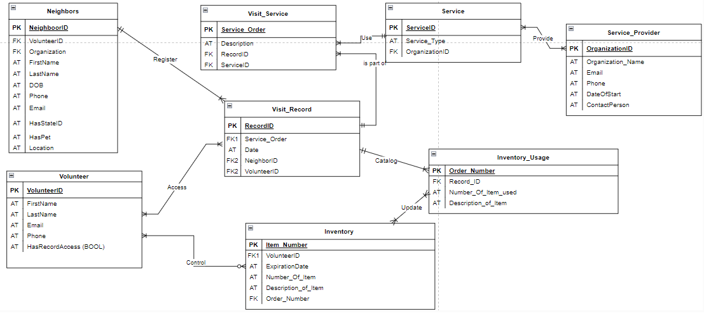

# UP initiative project v1

This project was designed as part of the course Computer Science 330 - Database Systems in the Spring of 2024. We partner with the organization UP Initiative of Madison County to assist in their mission of supporting unhoused individuals and people struggling with housing security in the region

## PURPOSE OF THE APPLICATION 
The UP Initiative, founded in late 2023, plays a crucial role in supporting the community with two primary needs:
### Centralization of information:  
The UP Initiative aims to centralize all data related to neighbors, partners, and organizational activities. This centralized information repository is vital for facilitating grant applications and generating annual reports, ensuring streamlined access for organizational follow-ups.
### Control of Inventory: 
Enhanced inventory management is crucial for the UP Initiative. Accurate inventory tracking helps communicate current needs to potential donors, identifying which items are most needed and which are plentiful.

## Key Documentation and Project Insights:
###
Detailed project milestones and decision-making processes are documented under:

## Created by: 
Sara Adhikari,
Matheus Bender,
Nicholas Hamilton,
Michel Moncada-Rabassa

# Database Usage Instructions
## Setup and Operation
To use the application database, follow these steps:
###  How to use database:
Step 1 -> download all required files: package.json, pipfile.lock, Requirements.md
Step 2 -> setup a backend server: on the terminal, open "flaskapp directory", start the "pipenv shell" virtual environment, run app.py "python app.py" (send API calls to frontend)
### For backend, on the terminal, type
cd flaskapp
pipenv shell
python app.py
Step 3 -> setup a frontend server: directory ""frontend" and start node.js. The below commands run a local environment, but creating the site will need npm to build.
### For frontend, on the terminal, type:
cd frontend
npm run serve 

## Development 
The development of the UP Initiative application involved a thorough planning phase that defined the conceptualization, business rules, relationships, cardinalities, and the database schema.

## Project Entities and Attributes:
### Neighbors:  
a houseless person who seeks UP for support. They can be classified as emergency housed (e.g. a person sleeps in someone’s house), underhoused (they may have a shelter, but it is not optimal. e.g. a shed or trailer without access to electricity or water, or similar precarious situations).
Attributes: NeighborID, FirstName, LastName, Date of Birth, phone, email HasStateId (bool), HasPet (bool), location.

### Volunteer: 
a person who works at UP initiative and can or cannot have access to records.
Attributes: VolunteerID, FirstName, LastName, Email, Phone, HasRecordAccess (bool)

### Visit Service:
in order to catalog what activities UP is doing, the visit service registers what specific unique work was done to the Neighbor in consultation.
Attributes: ServiceOrder, description, RecordID (foreignKey)

### Visit Record: history of services provided per day to different neighbors.
Attributes: RecordID, Service_Order (foreign key), NeighborID (foreign Key), VolunteerID (Foreign Key)

### Service Providers: 
every organization that assist the neighbors, being UP itself or their partners.
Attributes: OrganizationID, Organization_Name, Email, Phone, DateofStart, ContactPerson.

### Service: 
The type of services that one organization can provide
Attributes: ServiceID, Service_Type, OrganizationID (foreign key)

### Inventory: 
the organization has an inventory of clothing, hygiene kits, and food, and there are some guidelines about how many items can a neighbor have. These guidelines are always changing on a case-by-case basis. UP also envisions this process being automatize and displayed on their website so donors can see what the organization needs the most.
Attributes: Item_Number, VolunteerID, ExpirationDate, NumerofItem, Description_of_Item

### Inventory_Usage: 
accountability of the items from the inventory used on a service provided by UP to neighbors.
Attributes: Order_Number, RecordID (foreign key), NumberofItem, DescriptionOfItem 

## Business Rules

A NEIGHBOR is registered by a VOLUNTEER on the VISIT RECORD only once on their second visit to UP, whereas the RECORD registers only one NEIGHBOR by at least one VOLUNTEER.

A VISIT SERVICE can be part of only one VISIT RECORD, and a VISIT RECORD has part on many VISIT SERVICE. 

A VISIT SERVICE uses only one SERVICE, whereas a SERVICE is used in at least one VISIT SERVICE.

A SERVICE PROVIDER provides at least one SERVICE, whereas a SERVICE can be provided by at least one SERVICE PROVIDER.

The INVENTORY is controled by at least one VOLUNTEER, whereas a VOLUNTEER controls optional many INVENTORY items.

The INVENTORY is updated by at least one INVENTORY USAGE form, whereas an INVENTORY USAGE log updates at least one INVENTORY item.

The VISIT RECORD catalogs at least one INVENTORY USAGE, whereas an INVENTORY USAGE is cataloged by only one VISIT RECORD.

An VOLUNTEER has access to many VISIT RECORD data, whereas the VISIT RECORD can be accessed by many VOLUNTEERS with access.

Using the VISIT SERVICE, a VOLUNTEER can start a process to assist the NEIGHBOR in receiving many VISIT SERVICE. 

A VISIT SERVICE is provided by one SERVICE PROVIDER , whereas a SERVICE PROVIDER can provide at least one SERVICE. The SERVICE is then tracked on the NEIGHBOR’s record and followed up as necessary by at least one UP ADMINISTRATOR. 

## Conceptual Model
The tables of UP database follow the following dynamic:

"Visit_Record" has a neighbor registered by a volunteer who has access permission. That record centralizes vital information about the neighbor and their visits to UP. Through "Visit_Service", UP can follow which service in used by which neighbor. The services are provided by partners or UP, which is stored in a associative entity called "Service". "Service" is connected to "Service_Provider", which in turn have further information about each partner that assists UP's mission or UP itself.

On the rest of the relations, "Visit_Record" have the information about people working at UP, called "Volunteer". The "Volunteer" control the inventory, and can have access to the "Visit_Record". Once a "Visit_Service" that uses UP's inventory is stored in "Visit_Record", the "Inventory_Usage" catalogs the change, updating the "Inventory" table. 

Below is the database schema for illustrating the explanation above:

