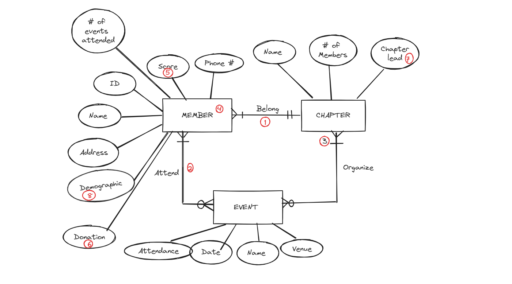

# Milestone 1

## Business Rules

1. A member can belong to only one chapter, but a chapter can have one or many members.
2. A member can attend one or many events, but an event can be attended by one or more members.
3. A chapter can organize zero or multiple events, but an event can be organized by one or more chapters.
4. A member can be anybody who attends an event or fills out a survey created by the chapter.
5. A member has an engagement score that keeps track of how active or inactive they are.
6. An engagement score can be obtained when a member attends an event or makes a donation.
7. A donation can be in the form of monetary, equipment, or service.
8. A chapter can have only one chapter leader at a time.
9. A member's demographics include their race, gender, and pronouns.

## Entities

### 1. Chapter

A chapter is a group of members in a certain geographical area who have similar interests.

**Attributes:**

- **Name**: The name of the chapter.
- **Number of Members**: The number of participants in a chapter.
- **Chapter Lead**: The person who is in charge of the chapter.

### 2. Member

Someone who attends an event or makes a donation.

**Attributes:**

- **Name**: The name of the member (can be first and last name).
- **ID**: The identification number of the member.
- **Address**: The address or mailing address of the member.
- **Phone Number**: The phone number of the member.
- **Engagement Score**: A metric system that keeps track of how active members are within the chapter.
- **Demographics**: The demographics of the member entail things like race, gender, and pronouns.
- **Number of Events Attended**: This entails the number of events attended.

### 3. Event

An event is a gathering that has one or more members participating.

**Attributes:**

- **Name**: Event name (event objective).
- **Date**: Date when the event took place (MM/DD/YYYY).
- **Venue**: Location of the event.
- **Attendance**: The number of people at the event.

## ER Diagram

---

Document Link: https://docs.google.com/document/d/1xs227zgCnU8y_3lzEl-bQvKeSdAjbs4DNt9NGn95F_c/edit
