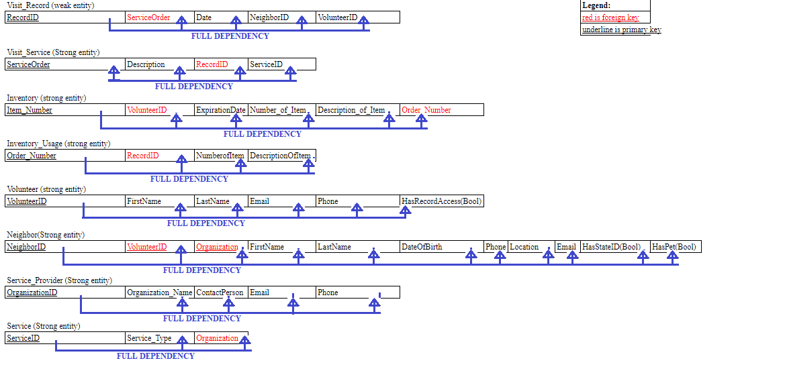

UP initiative v1

###This project was designed as part of the course Computer Science 330 - Database Systems in the Spring of 2024. We partner with the organization UP Initiative of Madison County to assist in their mission of supporting unhoused individuals and people struggling with housing security in the region###

##PURPOSE OF THE APPLICATION##
UP initiative was founded in late 2023, and their work supports the community. Their main needs include:
#Centralization of information:# 
UP wants for all of their neighbors,  partners, and overall organization to be easy accessible for grant application and annual report purposes. Therefore, they want a centralized record of everything the organization does and easy access for follow-up of everyone the organization assists.
#Control of Inventory:#  
They want to have a better control of inventory so in the future they can announce what items are mostly needed and what items are abundant.

##Technical Information for Class purposes##
Here you can find more information regarding the project milestones while we took CSC 330
(Milestones_Progress.md)

##Created by:##
Sara Adhikari,
Matheus Bender,
Nicholas Hamilton,
Michel Moncada-Rabassa

##How to Use:##

###Development###
This project starts with conceptualization and business rules, followed by relationships and cardinalities, and UP database conceptual schema.

##Project entities##
#Neighbors:# a houseless person who seeks UP for support. They can be classified as emergency housed (e.g. a person sleeps in someone’s house), underhoused (they may have a shelter, but it is not optimal. e.g. a shed or trailer without access to electricity or water, or similar precarious situations).
Attributes: NeighborID, FirstName, LastName, Date of Birth, phone, email HasStateId (bool), HasPet (bool), location.

#Volunteer:# a person who works at UP initiative and can or cannot have access to records.
Attributes: VolunteerID, FirstName, LastName, Email, Phone, HasRecordAccess (bool)

#Visit Service:# in order to catalog what activities UP is doing, the visit service registers what specific unique work was done to the Neighbor in consultation.
Attributes: ServiceOrder, description, RecordID (foreignKey)

#Visit Record:# history of services provided per day to different neighbors.
Attributes: RecordID, Service_Order (foreign key), NeighborID (foreign Key), VolunteerID (Foreign Key)

#Service Providers:# every organization that assist the neighbors, being UP itself or their partners.
Attributes: OrganizationID, Organization_Name, Email, Phone, DateofStart, ContactPerson.

#Service:# The type of services that one organization can provide
Attributes: ServiceID, Service_Type, OrganizationID (foreign key)

#Inventory:# the organization has an inventory of clothing, hygiene kits, and food, and there are some guidelines about how many items can a neighbor have. These guidelines are always changing on a case-by-case basis. UP also envisions this process being automatize and displayed on their website so donors can see what the organization needs the most.
Attributes: Item_Number, VolunteerID, ExpirationDate, NumerofItem, Description_of_Item

#Inventory_Usage:# accountability of the items from the inventory used on a service provided by UP to neighbors.
Attributes: Order_Number, RecordID (foreign key), NumberofItem, DescriptionOfItem 

##Business Rules##

A NEIGHBOR is registered by a VOLUNTEER on the VISIT RECORD only once on their second visit to UP, whereas the RECORD registers only one NEIGHBOR by at least one VOLUNTEER.

A VISIT SERVICE can be part of only one VISIT RECORD, and a VISIT RECORD has part on many VISIT SERVICE. 

A VISIT SERVICE uses only one SERVICE, whereas a SERVICE is used in at least one VISIT SERVICE.

A SERVICE PROVIDER provides at least one SERVICE, whereas a SERVICE can be provided by at least one SERVICE PROVIDER.

The INVENTORY is controled by at least one VOLUNTEER, whereas a VOLUNTEER controls optional many INVENTORY items.

The INVENTORY is updated by at least one INVENTORY USAGE form, whereas an INVENTORY USAGE log updates at least one INVENTORY item.

The VISIT RECORD catalogs at least one INVENTORY USAGE, whereas an INVENTORY USAGE is cataloged by only one VISIT RECORD.

An VOLUNTEER has access to many VISIT RECORD data, whereas the VISIT RECORD can be accessed by many VOLUNTEERS with access.

Using the VISIT SERVICE, a VOLUNTEER can start a process to assist the NEIGHBOR in receiving many VISIT SERVICE. 

A VISIT SERVICE is provided by one SERVICE PROVIDER , whereas a SERVICE PROVIDER can provide at least one SERVICE. The SERVICE is then tracked on the NEIGHBOR’s record and followed up as necessary by at least one UP ADMINISTRATOR. 

##Conceptual Model
Here is the database schema for better understanding.

##Normalization on the third form

